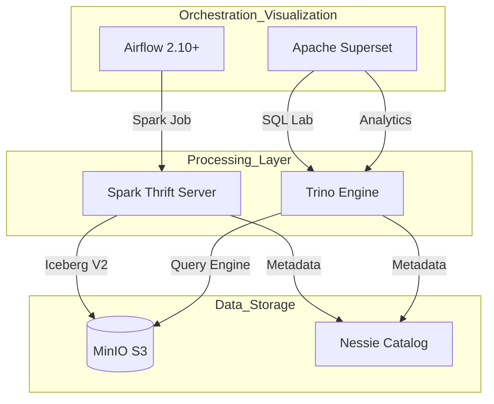

# 🚀 Modern ETL Platform Overview (Local K8s)

본 프로젝트는 **Airflow**, **Spark**, **Trino**, **Nessie**, **Iceberg**, **MinIO**, **Superset**을 결합한 최신형 데이터 레이크하우스(Lakehouse) 아키텍처의 로컬 실습 환경입니다.

---

## 🏗️ 1. 아키텍처 다이어그램 (Logical Flow)

---

## 🛠️ 2. 구성 요소 상세 (로컬/내부 정보)

| 컴포넌트 | 역할 | 내부 DNS (Service) | 포트 | 외부 접속 URL |
| :--- | :--- | :--- | :--- | :--- |
| **Airflow** | 워크플로우 관리 | `airflow-webserver.airflow.svc` | 8080 | [http://localhost:8080](http://localhost:8080) |
| **Spark STS** | SQL 가공 및 적재 | `spark-thrift-server.spark.svc` | 10000 | `jdbc:hive2://localhost:10000` |
| **Trino** | 고속 쿼리 엔진 | `trino.trino.svc` | 8080 | [http://localhost:18080](http://localhost:18080) |
| **Nessie** | Git-like 카탈로그 | `nessie.nessie.svc` | 19120 | 내부 전용 (REST API) |
| **MinIO** | 객체 스토리지 | `minio.minio.svc` | 9000/1 | [http://localhost:9001](http://localhost:9001) |
| **Superset** | BI 및 시각화 | `superset.superset.svc` | 8088 | [http://localhost:8088](http://localhost:8088) |

---

## ⚡ 3. 인프라 및 데이터 관리 (`manage-project.sh`)

모든 리소스는 의존성에 따라 **순차적으로 관리**됩니다.

### 실행 명령어
*   `./manage-project.sh start`: **[권장]** 의존성에 따른 5단계 순차 기동 및 데이터 자동 적재
*   `./manage-project.sh stop`: 리소스 절약을 위해 모든 워크로드 정지 (Scale 0)
*   `./manage-project.sh status`: 전체 컴포넌트의 가동 상태 확인
*   `./manage-project.sh deploy`: Helm 차트 및 설정 파일 재배포

### 🔄 순차 기동 로직 (Stage 0 ~ 5)
1.  **Stage 0**: KEDA (오토스케일러) 기동
2.  **Stage 1**: MinIO 기동 및 `iceberg-data` 버킷 자동 생성
3.  **Stage 2**: Nessie & Spark Operator 기동 (MinIO 의존성)
4.  **Stage 3**: Trino & Spark Thrift Server 기동 (Nessie 의존성) + **Spark Job으로 샘플 데이터 적재**
5.  **Stage 4**: Airflow & Superset 기동 및 **DB 마이그레이션/초기화**
6.  **Stage 5**: **데이터 통합 마무리** (`init_data.sh` 자동 실행 - Superset DB 연결 등)

---

## 📊 4. 데이터 조회 가이드 (DBeaver 기준)

### 카탈로그 통합 네이밍
*   Spark와 Trino 모두 **`iceberg`**라는 이름의 카탈로그를 사용합니다.
*   샘플 데이터 위치: `iceberg.ecommerce.customers`, `iceberg.ecommerce.products`, `iceberg.ecommerce.orders`

### DBeaver 연결 팁
1.  **Trino (localhost:18080)**: 메타데이터 탐색기(Tree)를 통해 테이블 구조를 시각적으로 확인하기에 최적화되어 있습니다.
2.  **Spark (localhost:10000)**: 
    *   Thrift Server의 한계로 인해 탐색기 트리에는 `iceberg` 카탈로그가 보이지 않을 수 있습니다.
    *   **해결책**: 연결 설정의 `Bootstrap Queries`에 `USE iceberg;`를 등록하거나, SQL 편집기에서 직접 쿼리하시면 정상 조회됩니다.

---

## 📝 5. 핵심 설정 파일 위치
*   **Airflow**: `airflow/custom-values.yaml`
*   **Spark STS**: `spark/spark-thrift-server.yaml`
*   **Trino**: `trino/values.yaml`
*   **운영 로직**: `manage-project.sh`, `init_data.sh`

> **주의**: 본 환경의 모든 데이터베이스(PostgreSQL, Redis 등)는 **휘발성(Ephemeral)**입니다. OrbStack이나 서비스를 재시작할 경우 데이터가 초기화되지만, `./manage-project.sh start` 명령어가 이를 감지하여 자동으로 관리자 계정 생성 및 샘플 데이터 복구를 진행합니다.
