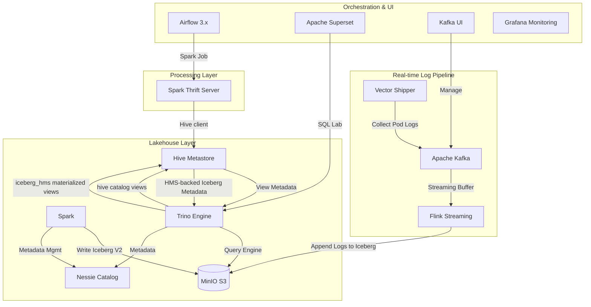

# 🚀 Modern ETL Platform Overview (Local K8s)

This project is a local evaluation environment for a modern **Data Lakehouse** architecture, combining **Airflow**, **Spark**, **Trino**, **Nessie**, **Iceberg**, **Hive Metastore**, **MinIO**, **Superset**, **Kafka**, and **Vector**.

---

## 🏗️ 1. Architecture Diagram (Logical Flow)



---

## 🛠️ 2. Component Details (Internal/Local Info)

| Component | Role | Internal DNS (Service) | Port | External URL |
| :--- | :--- | :--- | :--- | :--- |
| **Airflow** | Workflow Mgmt | `airflow-webserver.airflow.svc` | 8080 | [http://localhost:8080](http://localhost:8080) |
| **Spark STS** | SQL ETL/Load | `spark-thrift-server.spark.svc` | 10000 | `jdbc:hive2://localhost:10000` |
| **Trino** | Fast Query Engine | `trino.trino.svc` | 8080 | [http://localhost:18080](http://localhost:18080) |
| **Flink** | Streaming Processor | `flink-jobmanager.flink.svc` | 8081 | [http://localhost:8081](http://localhost:8081) |
| **Kafka UI** | Message Monitoring| `kafka-ui.kafka.svc` | 9080 | [http://localhost:9080](http://localhost:9080) |
| **Kafka Broker**| Message Bus (KRaft)| `kafka.kafka.svc` | 9092 | `localhost:9092` |
| **Superset** | BI & Visualization | `superset.superset.svc` | 8088 | [http://localhost:8088](http://localhost:8088) |
| **Grafana** | Monitoring | `prometheus-grafana.monitoring.svc` | 3000 | [http://localhost:3000](http://localhost:3000) |
| **MinIO** | Object Storage | `minio.minio.svc` | 9000/1 | [http://localhost:9001](http://localhost:9001) |
| **Nessie** | Git-like Catalog | `nessie.nessie.svc` | 19120 | Internal Only (REST API) |
| **Hive Metastore** | Shared View/MV Metadata Store | `hive-metastore.hive-metastore.svc` | 9083 | Internal Only (Thrift) |

---

## 🧭 3. Catalog Layout

Trino exposes multiple catalogs. The project-owned catalogs are:

| Catalog | Backing Service | Intended Use |
| :--- | :--- | :--- |
| `iceberg` | Nessie REST catalog (`main`) + MinIO | Main Iceberg Lakehouse tables |
| `iceberg_dev` | Nessie REST catalog (`dev`) + MinIO | Development branch/testing catalog |
| `hive` | Hive Metastore | Reusable Trino SQL views and Hive-style metadata |
| `iceberg_hms` | Hive Metastore + MinIO | Trino materialized views and HMS-backed Iceberg tests |

Common object names:

```sql
-- Physical Iceberg tables
SELECT * FROM iceberg.ecommerce.customers;
SELECT * FROM iceberg.ecommerce.products;
SELECT * FROM iceberg.ecommerce.orders;

-- Reusable Trino views
CREATE SCHEMA IF NOT EXISTS hive.shared;
CREATE OR REPLACE VIEW hive.shared.customer_summary AS
SELECT country, count(*) AS customer_count
FROM iceberg.ecommerce.customers
GROUP BY country;

-- Trino materialized views
CREATE SCHEMA IF NOT EXISTS iceberg_hms.mart
WITH (location = 's3a://iceberg-data/hms-mart/');

CREATE MATERIALIZED VIEW iceberg_hms.mart.customer_summary_mv
WITH (format = 'PARQUET') AS
SELECT country, count(*) AS customer_count
FROM iceberg.ecommerce.customers
GROUP BY country;

REFRESH MATERIALIZED VIEW iceberg_hms.mart.customer_summary_mv;
```

Notes:

- `iceberg` is the source-of-truth catalog for Lakehouse data.
- `iceberg_dev` is the development branch catalog backed by Nessie.
- `iceberg.logs.k8s_logs_bronze` receives raw Kafka log events from the local Flink streaming bridge.
- `hive` is used as a view store for Trino-created persistent logical views.
- `iceberg_hms` is used for Trino materialized views. It is not Nessie-versioned.
- Use `iceberg.mart.*` CTAS tables when Spark and Trino both need to read the same physical mart dataset.
- Drop individual views with `DROP VIEW`; keep shared schemas like `hive.shared` for reuse.
- Trino also shows built-in catalogs such as `system`, `jmx`, `memory`, `tpch`, and `tpcds`.
- See [overview-data-storage.md](./overview-data-storage.md) for the full storage/view/mart decision guide.

---

## 🪵 4. Real-time Log Pipeline

The platform now includes a production-grade log collection pipeline:

- **Vector (Collector)**: Deployed as a **DaemonSet**. It identifies and tails all container logs from the host node and forwards them to Kafka in real-time.
- **Apache Kafka 3.9 (Buffer)**: Acts as a central buffer. Configured with a **FIFO (First-In-First-Out)** retention policy:
    - **Capacity Limit**: Max 500MB per topic.
    - **Time Limit**: Max 2 hours of retention.
    - **Reasoning**: Ensures the local M4 host machine doesn't run out of disk space while providing enough data for stream processing testing.
- **Apache Flink (Local Streaming Bridge)**: Runs a single JobManager and TaskManager with no PVC. It reads `k8s_logs` from Kafka and appends raw events to the Iceberg bronze table `iceberg.logs.k8s_logs_bronze`.
- **Flink SQL Source**: The streaming job SQL is stored at `flink/sql/k8s_logs_to_iceberg.sql`. `manage-project.sh` syncs it into the `flink-k8s-logs-sql` ConfigMap before submitting the runner job, so query logic can be reviewed without editing Kubernetes YAML.
- **Kafka UI**: Provides a visual interface to browse topics (`k8s_logs`) and inspect JSON payloads.

---

## 🧩 5. Processing Responsibilities

| Engine | Primary Role | Best Fit | Avoid Using It For |
| :--- | :--- | :--- | :--- |
| **Flink** | Continuous stream processing | Kafka ingestion, dedup, window aggregation, near-real-time Iceberg writes | Ad hoc BI queries and frequently changing report SQL |
| **Trino** | Interactive SQL query engine | Iceberg exploration, dashboards, shared SQL views, sandbox CTAS | Durable streaming ingestion and heavy stateful processing |
| **Spark** | Large batch compute | Backfills, historical reprocessing, heavy ETL, ML/data prep | Lightweight always-on local streaming |
| **Airflow** | Orchestration | Scheduling Spark/dbt/SQL jobs, dependency management, operational retries | Per-event streaming logic |

Operationally, this means:

- Keep `etl-platform` focused on local infrastructure, base images, reference jobs, and startup/repair scripts.
- Move production business logic into a separate `analytics-pipelines` or `etl-workflows` repository when the team starts managing real DAGs, Flink SQL jobs, dbt models, or governed mart SQL.
- Use Trino/Superset/Jupyter for ad hoc analysis against Iceberg. Write experiments to `sandbox` or `tmp` schemas instead of overwriting `bronze`, `silver`, or `gold` tables.
- Keep Flink jobs for logic that needs event time, ordering, state, windows, deduplication, or low-latency writes.

Recommended data path:

```text
Pod Logs -> Vector -> Kafka -> Flink -> Iceberg bronze/silver
                                      -> Trino/Superset for query and ad hoc analysis
Iceberg -> Spark/Airflow/dbt -> Iceberg mart/gold for batch refinement
```

---

## ⚡ 6. Infra & Data Management (`manage-project.sh`)

### 🔄 Sequential Startup Logic
1.  **Stage 0**: KEDA (Autoscaler)
2.  **Stage 1**: MinIO (Storage Setup)
3.  **Stage 1.5/1.6**: **Kafka & Vector (Log Pipeline Setup)** ✅
4.  **Stage 2**: Nessie & Spark Operator (Catalog Setup)
5.  **Stage 2.5**: Hive Metastore (Shared View Store; requires Airflow PostgreSQL database bootstrap)
6.  **Stage 3/3.6**: Trino, Spark Thrift Server, sample data, and **Flink Kafka → Iceberg bridge**
7.  **Stage 4**: Airflow & Superset (App Setup)
8.  **Stage 5**: Final Data Integration (Auto `init_data.sh`)

---

## 🧪 7. Common Local Checks

```bash
# Start or resubmit only the local Flink streaming bridge
./manage-project.sh start flink

# Check running Flink jobs
curl -sS http://localhost:8081/jobs/overview

# Query streamed logs through Trino
kubectl exec -n trino deploy/trino -- trino --execute "
SELECT *
FROM iceberg.logs.k8s_logs_bronze
ORDER BY ingested_at DESC
LIMIT 20
"
```

Because the local policy is no PVC, stopping OrbStack or wiping the platform removes runtime state. This is intentional for local testing. A production migration should add durable object storage, Flink checkpoints/savepoints, catalog backup/HA, resource isolation, access control, and CI/CD around pipeline repositories.

---

## 📝 8. Operational Study Notes
For a deep dive into the technical challenges faced during infrastructure setup (e.g., KRaft mode configuration, ARM64 image issues), refer to the study documents in:
- `study/study-2026-04-20-kafka-infrastructure-troubleshooting.md`
- `study/study-2026-05-15-hive-metastore-trino-view-store.md`
- `study/study-2026-05-16-todo-materialized-view-trino-iceberg-nessie.md`

> **Note**: Kafka, Redis, app DBs, and the Hive Metastore backing DB are local-development ephemeral services. Permanent Lakehouse storage is represented by the MinIO S3 layer plus Iceberg metadata through Nessie or Hive Metastore, depending on catalog.
