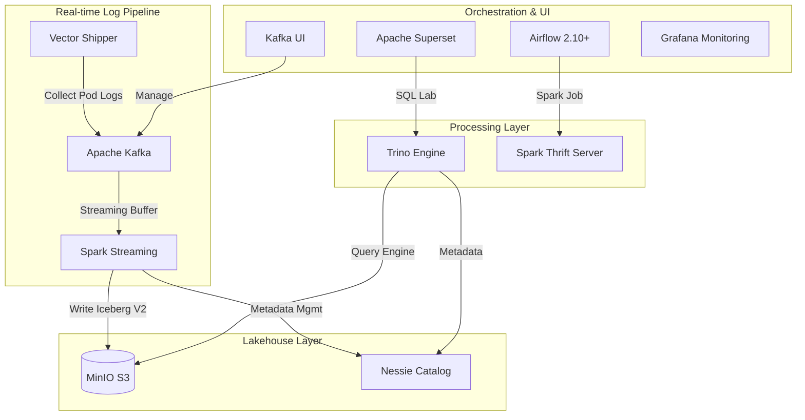

# 🚀 Modern ETL Platform Overview (Local K8s)

This project is a local evaluation environment for a modern **Data Lakehouse** architecture, combining **Airflow**, **Spark**, **Trino**, **Nessie**, **Iceberg**, **MinIO**, **Superset**, **Kafka**, and **Vector**.

---

## 🏗️ 1. Architecture Diagram (Logical Flow)

---

## 🛠️ 2. Component Details (Internal/Local Info)

| Component | Role | Internal DNS (Service) | Port | External URL |
| :--- | :--- | :--- | :--- | :--- |
| **Airflow** | Workflow Mgmt | `airflow-webserver.airflow.svc` | 8080 | [http://localhost:8080](http://localhost:8080) |
| **Spark STS** | SQL ETL/Load | `spark-thrift-server.spark.svc` | 10000 | `jdbc:hive2://localhost:10000` |
| **Trino** | Fast Query Engine | `trino.trino.svc` | 8080 | [http://localhost:18080](http://localhost:18080) |
| **Kafka UI** | Message Monitoring| `kafka-ui.kafka.svc` | 9080 | [http://localhost:9080](http://localhost:9080) |
| **Kafka Broker**| Message Bus (KRaft)| `kafka.kafka.svc` | 9092 | `localhost:9092` |
| **Superset** | BI & Visualization | `superset.superset.svc` | 8088 | [http://localhost:8088](http://localhost:8088) |
| **Grafana** | Monitoring | `prometheus-grafana.monitoring.svc` | 3000 | [http://localhost:3000](http://localhost:3000) |
| **MinIO** | Object Storage | `minio.minio.svc` | 9000/1 | [http://localhost:9001](http://localhost:9001) |
| **Nessie** | Git-like Catalog | `nessie.nessie.svc` | 19120 | Internal Only (REST API) |

---

## 🪵 3. Real-time Log Pipeline (New)

The platform now includes a production-grade log collection pipeline:

- **Vector (Collector)**: Deployed as a **DaemonSet**. It identifies and tails all container logs from the host node and forwards them to Kafka in real-time.
- **Apache Kafka 3.9 (Buffer)**: Acts as a central buffer. Configured with a **FIFO (First-In-First-Out)** retention policy:
    - **Capacity Limit**: Max 500MB per topic.
    - **Time Limit**: Max 2 hours of retention.
    - **Reasoning**: Ensures the local M4 host machine doesn't run out of disk space while providing enough data for stream processing testing.
- **Kafka UI**: Provides a visual interface to browse topics (`k8s_logs`) and inspect JSON payloads.

---

## ⚡ 4. Infra & Data Management (`manage-project.sh`)

### 🔄 Sequential Startup Logic (Stage 0 ~ 5)
1.  **Stage 0**: KEDA (Autoscaler)
2.  **Stage 1**: MinIO (Storage Setup)
3.  **Stage 1.5/1.6**: **Kafka & Vector (Log Pipeline Setup)** ✅
4.  **Stage 2**: Nessie & Spark Operator (Catalog Setup)
5.  **Stage 3**: Trino & Spark Thrift Server (Processing Setup) + **Sample Data Load**
6.  **Stage 4**: Airflow & Superset (App Setup)
7.  **Stage 5**: Final Data Integration (Auto `init_data.sh`)

---

## 📝 5. Operational Study Notes
For a deep dive into the technical challenges faced during infrastructure setup (e.g., KRaft mode configuration, ARM64 image issues), refer to the study documents in:
- `study/study-2026-04-20-kafka-infrastructure-troubleshooting.md`

> **Note**: All data storage (Kafka, Redis, DBs) is **Ephemeral** by design to maintain a clean local environment. Permanent storage is represented by the MinIO S3 layer.
