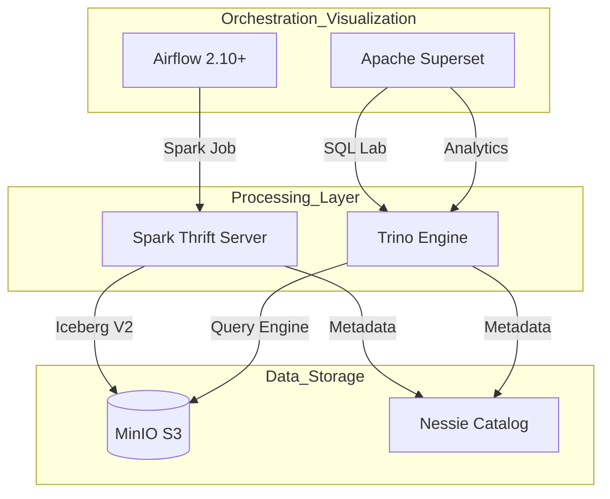

# 🚀 Modern ETL Platform Overview (Local K8s)

This project is a local evaluation environment for a modern **Data Lakehouse** architecture, combining **Airflow**, **Spark**, **Trino**, **Nessie**, **Iceberg**, **MinIO**, and **Superset**.

---

## 🏗️ 1. Architecture Diagram (Logical Flow)

---

## 🛠️ 2. Component Details (Internal/Local Info)

| Component | Role | Internal DNS (Service) | Port | External URL |
| :--- | :--- | :--- | :--- | :--- |
| **Airflow** | Workflow Mgmt | `airflow-webserver.airflow.svc` | 8080 | [http://localhost:8080](http://localhost:8080) |
| **Spark STS** | SQL ETL/Load | `spark-thrift-server.spark.svc` | 10000 | `jdbc:hive2://localhost:10000` |
| **Trino** | Fast Query Engine | `trino.trino.svc` | 8080 | [http://localhost:18080](http://localhost:18080) |
| **Nessie** | Git-like Catalog | `nessie.nessie.svc` | 19120 | Internal Only (REST API) |
| **MinIO** | Object Storage | `minio.minio.svc` | 9000/1 | [http://localhost:9001](http://localhost:9001) |
| **Superset** | BI & Visualization | `superset.superset.svc` | 8088 | [http://localhost:8088](http://localhost:8088) |

---

## ⚡ 3. Infra & Data Management (`manage-project.sh`)

All resources are **managed sequentially** based on their dependencies.

### Command Guide
*   `./manage-project.sh start`: **[Recommended]** 5-stage sequential startup and automatic data loading.
*   `./manage-project.sh stop`: Stop all workloads (Scale 0) to save local resources.
*   `./manage-project.sh status`: Check the status of all components.
*   `./manage-project.sh deploy`: Re-deploy Helm charts and configuration files.

### 🔄 Sequential Startup Logic (Stage 0 ~ 5)
1.  **Stage 0**: KEDA (Autoscaler) startup.
2.  **Stage 1**: MinIO startup and automatic creation of `iceberg-data` bucket.
3.  **Stage 2**: Nessie & Spark Operator startup (Depends on MinIO).
4.  **Stage 3**: Trino & Spark Thrift Server startup (Depends on Nessie) + **Sample data load via Spark Job**.
5.  **Stage 4**: Airflow & Superset startup and **DB Migration/Initialization**.
6.  **Stage 5**: **Final Data Integration** (Automatic execution of `init_data.sh` - Superset DB registration, etc.)

---

## 📊 4. Data Query Guide (DBeaver/SQL Lab)

### Catalog Integration Naming
*   Both Spark and Trino use the catalog named **`iceberg`**.
*   Sample Data: `iceberg.ecommerce.customers`, `iceberg.ecommerce.products`, `iceberg.ecommerce.orders`

### Connection Tips
1.  **Trino (localhost:18080)**: Best for visual exploration of table structures via the Metadata Explorer.
2.  **Spark (localhost:10000)**: 
    *   Due to Thrift Server limitations, the `iceberg` catalog may not appear in the explorer tree.
    *   **Solution**: Register `USE iceberg;` in the `Bootstrap Queries` of the connection settings, or query directly in the SQL editor.

---

## 📝 5. Key Configuration File Locations
*   **Airflow**: `airflow/custom-values.yaml`
*   **Spark STS**: `spark/spark-thrift-server.yaml`
*   **Trino**: `trino/values.yaml`
*   **Operational Logic**: `manage-project.sh`, `init_data.sh`

> **Note**: All databases (PostgreSQL, Redis, etc.) in this environment are **Ephemeral**. Data is initialized when OrbStack or services restart; however, the `./manage-project.sh start` command detects this and automatically performs admin account creation and sample data recovery.
